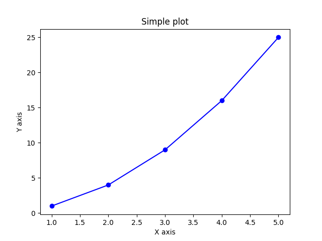

Pyembed is a [Mediawiki](https://www.mediawiki.org/) extension that allows you to use [Python](https://www.python.org/) as embedded language. The extension is inspired by [Scribunto](https://www.mediawiki.org/wiki/Extension:Scribunto) and is similar in many ways.


## Requirements

Extension requires a Python interpreter on the server side where Mediawiki is installed. By default, Pyembed uses the standard library, but you can configure additional modules that also need to be installed in the system. For details, see the [Security notes](#security-notes) section.


## Install

Download archive, create directory `extensions/Pyembed` and unpack to it. Next add to `LocalSettings.php`:

    wfLoadExtension('Pyembed');

Open page `Special:Version` and verify that the extension is successfully installed.


### Variables in LocalSettings.php

The extension can use variables declared in `LocalSettings.php`. Note about these parameters - see [Security notes](#security-notes).
*  **$wgPyembedDebugMode** - debug mode: `false` (default) or `true`.
*  **$wgPyembedAllowedModules** - plugging of additional Python modules. The value is an hash with module names as keys and a list of their objects to be resolved as values (see below).


## Security notes

The script code is executed using a sandbox, which receives the code, input parameters, additional options, and returns the output displayed further on the page. The sandbox implementation is based on the [ast](https://docs.python.org/3/library/ast.html) module. The module transforms the python source code into an _abstract syntax tree_ (AST), creates a subset of the language in which any potentially dangerous constructs are excluded - operators, functions, modules. These include operations with the file system and network, compiling and executing the code. The `sandbox/allowed.py` file defines lists of operators, functions, modules and their objects that are allowed to be used. Any others are prohibited. The input code is analyzed for the absence of prohibited objects and, if successful, is sent to the interpreter. Then the response from it is displayed further on the wiki page. If prohibited constructs are detected, the work is completed at the sandbox stage and an error message is displayed on the wiki page.

Input parameters are processed separately. The contents of the `input` parameter are processed according to a more strict scenario in a separate sandbox. Only variable definitions with explicit values ​​of strictly specified types are allowed. The list of types is defined in `sandbox/sandbox_input.py` itself. In case of successful processing, the transferred parameters are returned back in their original form, added to the called script and sent for execution. If prohibited constructions are detected, an error status is returned, further execution of the entire code is interrupted and the corresponding error is displayed on the page.

You can allow additional modules and a specific list of their objects using the `$wgPyembedAllowedModules` parameter in `LocalSettings.php`. However, this should be done carefully and only if you are sure that the module being allowed does not create security risks, does not work with the network or file system, does not compile object code and does not execute it.

Note about the `$wgPyembedDebugMode` parameter in `LocalSettings.php`. It is mainly useful when developing and debugging the extension code. It is not recommended to enable it in the working mode of the wiki, because it changes the behavior of the extension globally, and can also output technical information to the page, which may contain details about the technical implementation of the script code.


## Usage

### Simple call

After configuring the extension, a new namespace _Pyembed_ becomes available. You need to create a page with python code in it, for example `Pyembed:Test01` with the following content:

    print("Hello Pyembed")

Then, on some target page, enter the call structure in the following format:

    {{#pyembed:Test01}}

After which, the page will display the script output at the place where this structure is inserted:

    Hello Pyembed

This is an example of calling the entire script.


### Calling functions

Also you can call individual functions defined in the script code. For example, let's say you have a page with the code `Pyembed:Test02`:
```
def func01():
    print("Hello from function")
```
In this case, the call looks like this:

    {{#pyembed:Test02|func01}}

It is not recommended to mix these two types of code design in the script code. Either use the entire script for one purpose, or create a set of functions in it and then access the script specifying a particular function.
You can call functions with parameters and pass these parameters to them through the call structure. Let's say the functions are defined:
```
def func02(var):
    print(f"{var=}")

def func03(var1, var2=777):
    print(f"{var1=}; {var2=}")
```
Their call looks like this:

    {{#pyembed:Test02|func02|42}}
    {{#pyembed:Test02|func03|27|42}}
    {{#pyembed:Test02|func03|42}}

Or in parameterized form:

    {{#pyembed:Test02|func03|var2=27|var1=42}}


### Passing additional input parameters

Global variables can be defined and sent to the called script. They are handled more strictly (see [Security notes](#security-notes)). Parameters are defined in the `input` parameter in the format `key=val`
```
def func04():
    print(f"{global_var=}")
    for k,v in dct.items():
        print(f"{k} => {v}")
```
In this case, the call looks like this:
```
{{#pyembed:Test02|func04|input:
global_var = 42
dct = {
    'a': 1,
    'b': 2,
    'c': 3
    }
}}
```


### Output formatted text

By default, the text output is done with HTML formatting. The output HTML tags are rendered according to mediawiki permissions. It is also possible to output wiki markup. To do this, specify the corresponding `markup:wiki` parameter in the call. Example code:
```
def func05():
    print(f"Wiki markup: '''bold''' text [https://www.google.com/ URL]; sitename is '{{{{SITENAME}}}}'")
```
Example call:

    {{#pyembed:Test02|func05|markup:wiki}}

If the script output already contains some formatting in the form of indents, the wiki engine tries to preserve it by wrapping the output in `<pre>..</pre>` tags. To suppress this behavior, you can specify `markup:wiki` parameter.


### Using additional modules

In `LocalSettings.php` set the variable:
```
$wgPyembedAllowedModules = [
    'texttable'=>['Texttable', 'Texttable.field_names', 'Texttable.set_deco', 'Texttable.add_rows', 'Texttable.add_row', 'Texttable.draw', 'Texttable.VLINES'],
];
```
Also add to `Pyembed:Test02` the module import and function definition:
```
from texttable import Texttable

def func06(data):
    table = Texttable()
    table.set_deco(Texttable.VLINES)
    table.add_rows(data)
    print(table.draw())
```
Call:
```
{{#pyembed:Test02|func06|data|input:data = [
    ["Name", "Age", "Occupation"],
    ["Alice", 30, "Engineer"],
    ["Bob", 25, "Data Scientist"],
    ["Charlie", 35, "Teacher"]
    ]
}}
```
will display the table with specified data, enclosed in `<pre>..</pre>` tags to preserve formatting.


### Image output

The page displays only text information obtained as a result of executing the script. Therefore, to display an image on the page, it must be passed in text mode, encoded in `base64`, and then displayed as an embedded image, placing the image code in the `` tag. Here is an example of simple plot output. The `Pyembed:Test03` script code:
```
import matplotlib.pyplot as plt
import base64
from io import BytesIO

# Plot data
x = [1, 2, 3, 4, 5]
y = [1, 4, 9, 16, 25]

# Create plot
plt.plot(x, y, marker='o', linestyle='-', color='b')
plt.title("Simple plot")
plt.xlabel("X axis")
plt.ylabel("Y axis")

# Save plot in memory
buffer = BytesIO()
plt.savefig(buffer, format='png')
buffer.seek(0)

# encode to base64
image_base64 = base64.b64encode(buffer.read()).decode('utf-8')
buffer.close()

# Make HTML code for display on page
html_code = f''
print(html_code)
```
Call:

    {{#pyembed:Test03}}

Output:



In this case `pyplot` requires creating a temporary file. To avoid interaction with the file system, the `BytesIO` module is used, which allows creating a file buffer in memory and storing a temporary file there.

More complex example - using `mpl_toolkits.mplot3d` and [`numpy`](https://numpy.org/). The code of the `Pyembed:Test04` script:
```
import matplotlib.pyplot as plt
from mpl_toolkits.mplot3d import Axes3D
import numpy as np
import base64
from io import BytesIO

def plt3d(xvals, yvals):
    fig = plt.figure()
    ax = fig.add_subplot(111, projection='3d')

    x = np.linspace(*xvals)
    y = np.linspace(*yvals)
    x, y = np.meshgrid(x, y)
    z = np.sin(np.sqrt(x**2 + y**2))

    ax.plot_surface(x, y, z, cmap='viridis')

    buffer = BytesIO()
    plt.savefig(buffer, format='png')
    buffer.seek(0)

    image_base64 = base64.b64encode(buffer.read()).decode('utf-8')
    buffer.close()

    html_code = f''
    print(html_code)
```	
Call:

    {{#pyembed:Test04|plt3d|[-5, 5, 100]|[-7, 7, 120]}}

Output:


### Running async code

Why not??

Code of `Pyembed:Test05`:
```
import asyncio
from random import randint

async def task_coroutine(value):
    await asyncio.sleep(randint(1, 5)/100)
    print(f'coroutine <b>{value}</b> is running')

async def main():
    print('<h4>main coroutine started</h4>')
    tasks = [asyncio.create_task(task_coroutine(i)) for i in range(5)]
    for i, task in enumerate(tasks, start=1):
        print(f'Task <b>{i}</b> started')
    await asyncio.gather(*tasks)

def run():
    asyncio.run(main())
```
Call:
```
{{#pyembed:Test05|run}}
```
Output:

Task **1** started\
Task **2** started\
Task **3** started\
Task **4** started\
Task **5** started\
coroutine **2** is running\
coroutine **0** is running\
coroutine **3** is running\
coroutine **4** is running\
coroutine **1** is running\

In some cases, duplicated text output was observed. This is due to a conflict between the internal mechanisms of mediawiki and the `print()` command launched from the async code. In such cases, it is recommended to first accumulate all the output text in a variable, and then output the finished result.


### Example with pandas
Code of `Pyembed:Test06`:
```
import pandas as pd

def analyze_weather(data):
    df = pd.DataFrame(data)
    df['Date'] = pd.to_datetime(df['Date'])
    average_temp = df['Temperature'].mean()
    max_humidity = df['Humidity'].max()
    result = f"Average Temperature: {average_temp:.2f}°C\n"
    result += f"Max Humidity: {max_humidity}%\n"
    print(result)
```
Call:
```
{{#pyembed:Test06|analyze_weather|
[
    {"Date":"2025-01-01","Temperature":5,"Humidity":80},
    {"Date":"2025-01-02","Temperature":6,"Humidity":85},
    {"Date":"2025-01-03","Temperature":7,"Humidity":78},
    {"Date":"2025-01-04","Temperature":4,"Humidity":90},
    {"Date":"2025-01-05","Temperature":8,"Humidity":75}
]
}}
```
Result:
```
Average Temperature: 6.00°C
Max Humidity: 90%
```


## BUGS

Present.
